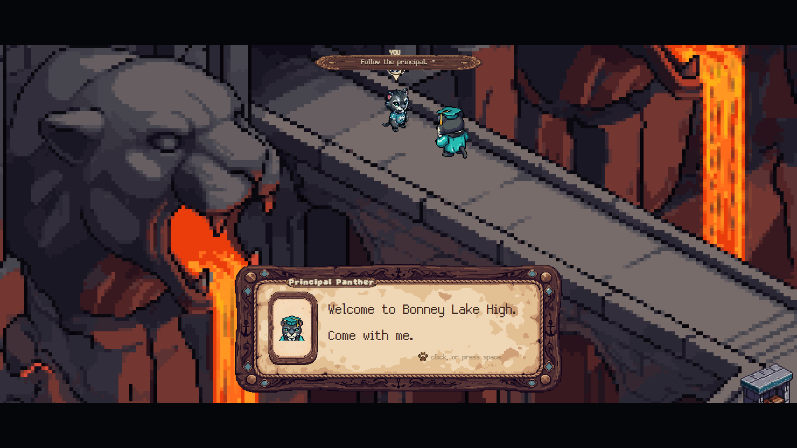

# Algorithmic Thinking Club

The computer science club at Bonney Lake High School. We build software the school actually
uses, and we compete.

## BLHS Island Explorer

An adventure game that teaches incoming freshmen what Bonney Lake offers: the clubs, the
sports, the electives, the cords they can earn. A student plays it in one advisory block,
sails between islands, and every island is one real thing at the school.

Play it: https://blhs-island-explorer.vercel.app

Three repositories make it:

- **[BLHS-Vine](https://github.com/Algorithmic-Thinking-Club/BLHS-Vine)** is the engine: the
  world, the character, the sailing, the year, and a Python vocabulary that islands are
  written in.
- **[BLHS-Island-Explorer](https://github.com/Algorithmic-Thinking-Club/BLHS-Island-Explorer)**
  is where members build islands. Three files in Python, one row to register it, and it is in
  the game. Start with the skeleton and the README.
- **[MAPVIS](https://github.com/ashwath-polali/MAPVIS)** is the map platform: a painting becomes a
  walkable world, with the mechanics drawn by hand, and it publishes straight into the game.

## Join

We meet after school in room 303. Beginners and experienced programmers both. Come build an
island, or come for the competitions: SkillsUSA Computer Programming (regional, state and
national in our first year) and hackathons through the year.
